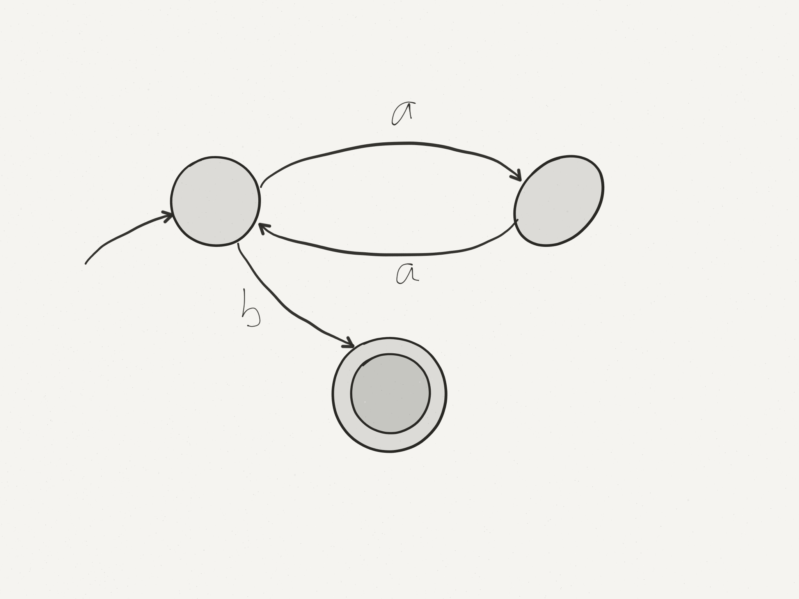
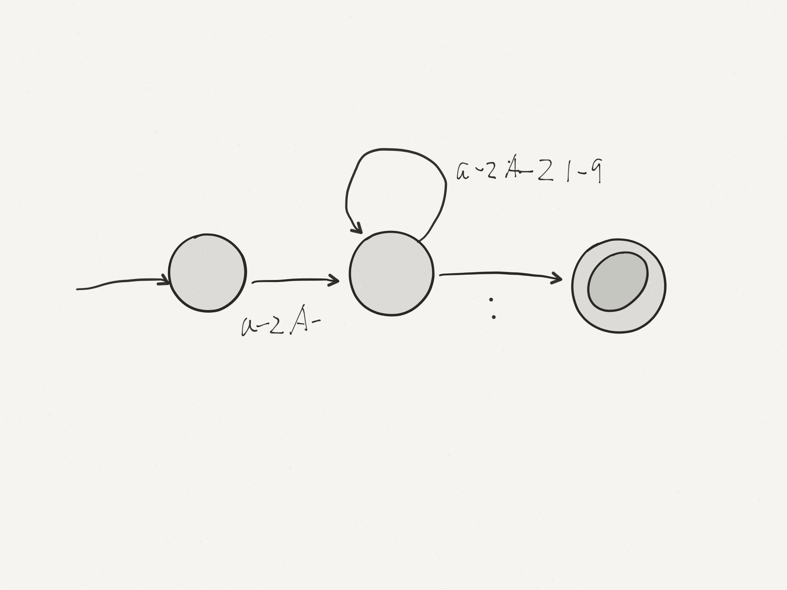
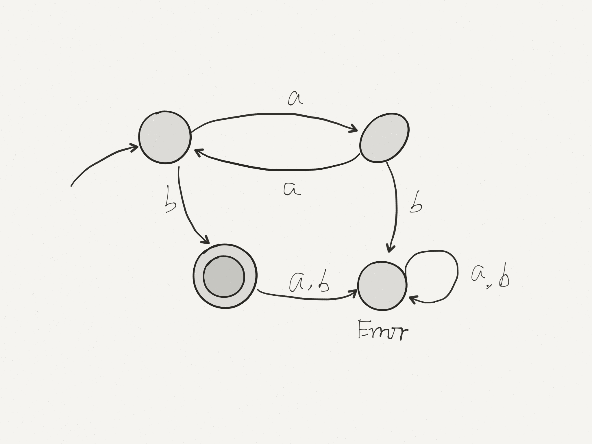
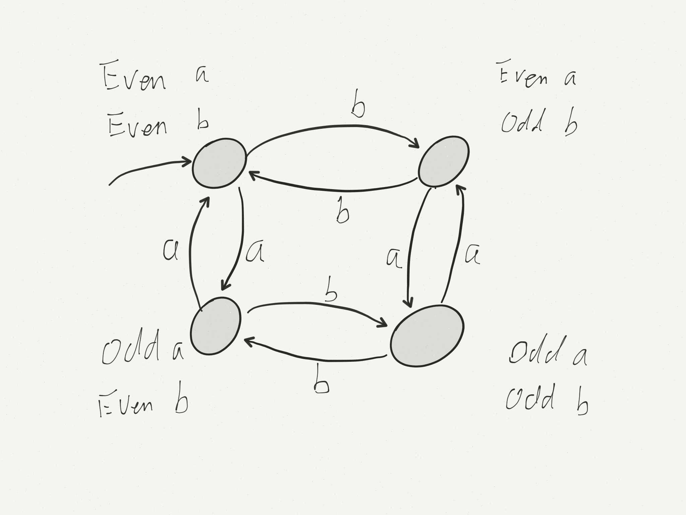

# Lecture 09

## Regular Languages
Built from

* finite language
* union
* concatenation
* repetition

#### Union 
$L_1 \cup L_2 = \{ x | x \in L_1 \lor x \in L_2\}$

#### Concatenation 
$L_1\cdot L_2=\{xy | x \in L_1 \land y \in L_2\}$

#### Repetition
$L^* = \{\epsilon\} \cup \{ xy | x \in L^* \land y \in L\}$

   $= \{\epsilon\} \cup L \cup L^2 \cup L^3 ...$

0 or more occurrences of a word L

e.g. Show: $\{a^{2n} b | b\geq 0 \}$ is regular

$(\{aa\})^*\cdot\{b\}$

## Regular Expressions

Short hand for regular languages

| Language | Regular Expressions | |
|-----|-----|-----|
| $\{\}$ | $\varnothing$ | empty language |
| $\{\epsilon\}$ | $\epsilon$ | language consisting of the empty word |
| $\{aaa\}$ | $aaa$ | singleton language |
| $L_1\cup L_2$ | $L_1 | L_2$ | alternation (union) |
| $L_1\cdot L_2$ | L_1L_2 | concatenation |
| $L^*$ | $L^*$ | repetition |

####Is C regular?
A C program is a sequence of token, each of which comes from a regular language.

$C\in \{$Valid C Tokens$\}^*$

How can we recognize an arbitrary regular expression automatically?

e.g. $\{a^{2n} b | b\geq 0 \}=(aa)^*b$

e.g. MIPS labels

## Deterministic Finite Automaton (DFA)
* always start at start state
* for each char in the input, follow the corresponding arc to the next state
* if on an accepting state when input is exhausted, accept, else reject.

#### What if there is no transition?

* Fall of the machine = reject. 
* More formally, an implicit "error" state all transitions go there.

No escape from error state, non-accepting.

Example: String over $\{a,b\}$ with an even number of $a$s and an odd number of $b$s

<!--- $\{\{a\{aa\}\}^*\{bb\}^*\}^*$ --->

## Formal Definition of DFA

A DFA is a 5-tuple $(\Sigma, Q, q, A, \delta)$ where

* $\Sigma$ is a finite non-empty set (alphabet)
* $Q$ is a finite non-empty set (states)
* $q_0 \in Q$ (start state)
* $A \in Q$ (accepting state)
* $\delta: Q \times \Sigma \rightarrow Q$ (transition function: state + input char -> state)

$\delta$ consume one character

* can extend $\delta$ to a function that consumes an entire word

#### Definition
$\delta ^*(q,\epsilon)=q$  
$\delta ^*(q, cw)=\delta ^*(\delta(q,c), w)$

We say a DFA $(\Sigma, Q, q_0, A, \delta)$ accepts a word $w$ if $\delta ^*(q_0, w)\in A$

If $M$ is a DFA, we denote by $L(M)$ ("the language of M") the set of all strings accepted by $M$:
$L(M)=\{w | M\enspace accepts\enspace w\}$

### Kleene Theorem

$L$ is regular iff $L=L(M)$ for some DFA $M$. (The regular languages are the languagges accepted by DFAs)
