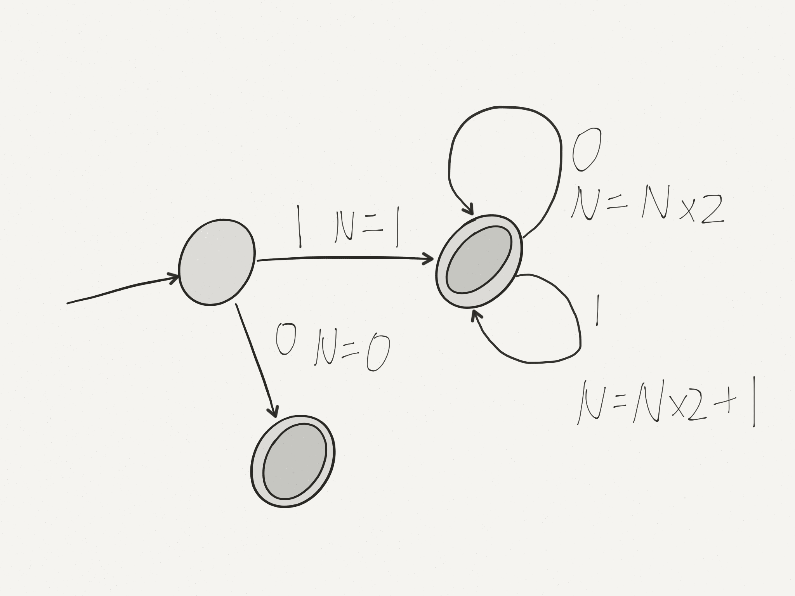
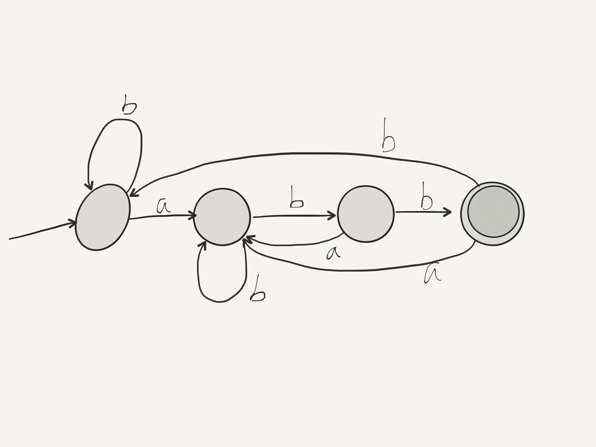
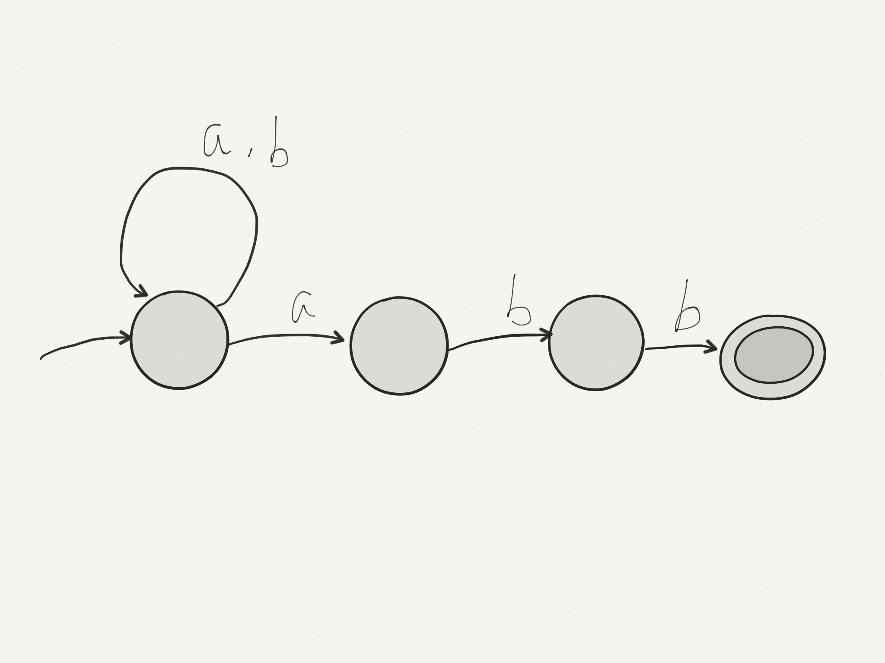

# Lecture 10

## Implementing a DFA
```
int state = q_0
char c
while not EOF do
	read c
	case state of
	q_0: case c of
		a: state = ...
		b: state = ...
		...
	q_1: case c of
		a: state = ...
		b: state = ...
		...
	...
	q_n: case c of
		a: state = ...
		b: state = ...
		...
end while
return state in A
```
Or: use a lookup table
```
 |characters
-|----------
s|
t|
a|   next
t|  states
e|
s|
```


## DFAs with actions
Can attach computations to the arcs of a DFA

e.g. $L=\{binary\enspace numbers\enspace with\enspace no\enspace leading\enspace 0s\}$, compute the value of the number - $1(0|1)^* | 0$



What do we gain by making DFAs more complex?

e.g. $L=\{w=\{a,b\}^* | w\enspace ends\enspace with\enspace abb\}$ $(a|b)^* abb$



## Non-deterministic Finite Automaton

What if we allowed more than one arc with the same character from the same state? What would this mean?

Machine chooses one direction or the other (.e. the machine is non-deterministic). Accept if some set of choices leads to an accepting state.

With non-determinism, the machine becomes:



Machine "guesses" to stay in the first state until it reaches the final "abb", the transitions to accepting.

NFAs often simpler than DFA. 

Formally NFA is a 5-tuple $(\Sigma, Q, q, A, \delta)$ where

* $\Sigma$ is a finite non-empty set (alphabet)
* $Q$ is a finite non-empty set (states)
* $q_0 \in Q$ (start state)
* $A \in Q$ (accepting state)
* $\delta: Q \times \Sigma \rightarrow subset\enspace of\enspace Q$ ($2^Q$ - non-determinism)

Non-deterministic want to accept if some path through the NFA leads to acceptance for the given word. (reject if none do)

$\delta ^*$ for NFAs: set of states $\times\Sigma$ -> set of states

$\delta ^*(qs, \epsilon)=qs$

$\delta ^((qs, cw)=\delta ^*(\cup_{q\in qs}(\delta(q, c)), w)$

Then accept w if $\delta ^*(\{q_0\}, w)\cap A=\emptyset$

### NFA simulation precedure:
```
states <- {q_0}
while not EOF do
	read ch
	states = U_{q in states) delta(q, ch)
end do
return states intersect A is not empty
```

Already read input | Unread input | States
---|---|---
$\epsilon$ | $baabb$ | $\{1\}$
$b$ | $aabb$ | $\{1\}$
$ba$ | $abb$ | $\{1, 2\}$
$baa$ | $bb$ | $\{1, 2\}$
$baab$ | $b$ | $\{1, 3\}$
$baabb$ | $\epsilon$ | $\{1, 4\}$

$\{1,4\}\cup\{4\}=\{4\}\neq\emptyset$ accept

If you give each set of states a name, and call these the states, every NFA become a DFA.
