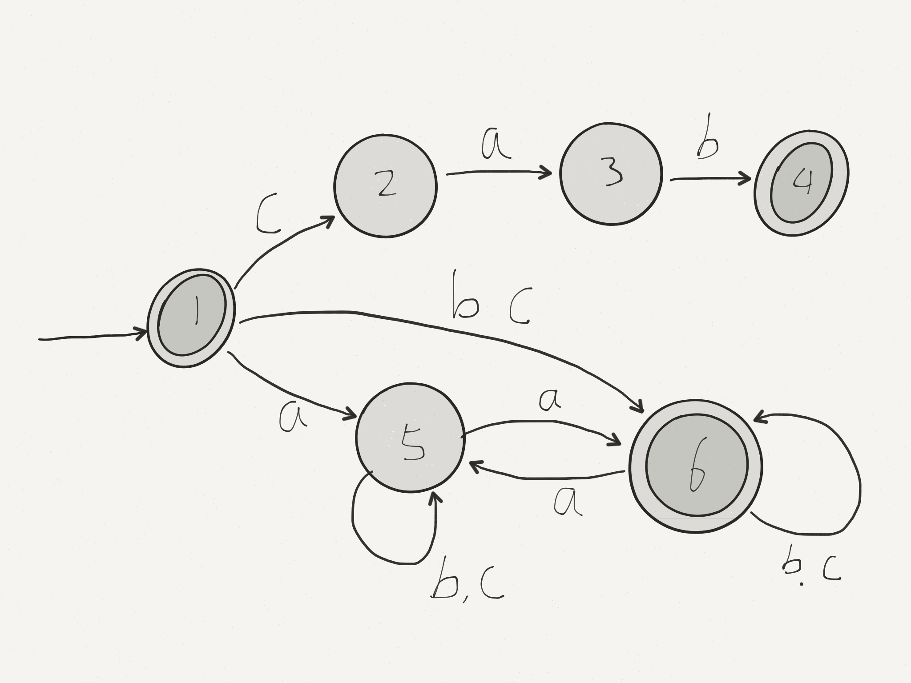
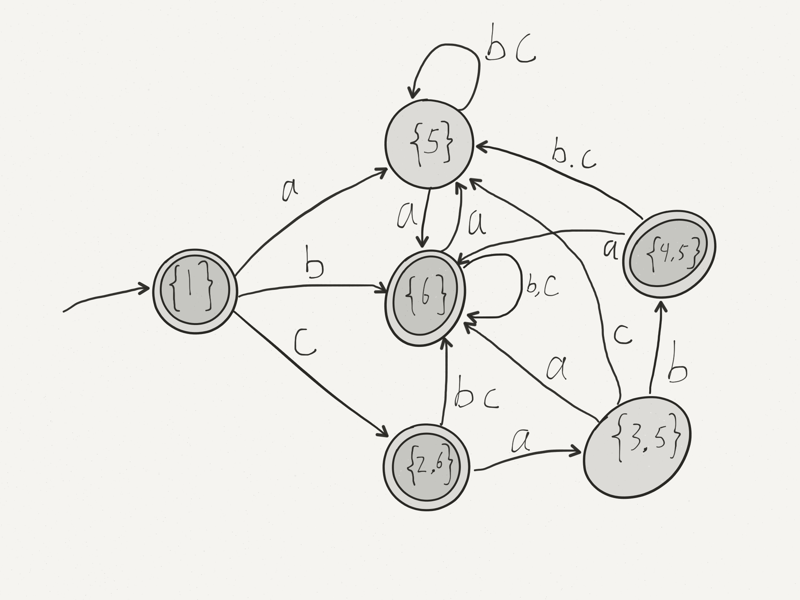

# Lecture 11

More complex example:

$L=\{cab\}\cup\{strings\enspace over\enspace \{a,b,c\}\enspace with\enspace an\enspace even\enspace number\enspace of\enspace a\}$

Read | Unread | States
---|---|---
$\epsilon$ | $caba$ | $\{1\}$
$c$ | $aba$ | $\{2,6\}$
$ca$ | $ba$ | $\{3,5\}$
$cab$ | $a$ | $\{4,5\}$
$caba$ | $\epsilon$ | $\{6\}$

Build DFA using the subset construction:

Accepting state: any state that includes an accepting state from the original NFA.

Obvious Fact: Every DFA is implicityly an NFA, where there is always onlye one choice.  
Also: Every DFA can be converted to a DFA for the same language.  
So NFA and DFA accept tha same class of language (regular).   

### $\epsilon$-NFA
What if we change states without reading a character.

$\epsilon$-transition -- "free pass to a new state without reading a character".   
It makes it easier to "glue" smaller machines together.

$L=\{cab\}\cup\{strings\enspace over\enspace \{a,b,c\}\enspace with\enspace an\enspace even\enspace number\enspace of\enspace a\}$

Read | Unread | States
---|---|---
$\epsilon$ | $caba$ | $\{1,2,6\}$
$c$ | $aba$ | $\{3,6\}$
$ca$ | $ba$ | $\{4,7\}$
$cab$ | $a$ | $\{5,7\}$
$caba$ | $\epsilon$ | $\{6\}$

By the same renaming trick as before, every $\epsilon$-NFA has a equivalent DFA.   
Therefore $\epsilon$-NFAs recognize the same class of languages as DFAs, and the conversion can be automated.

If we can find an $\epsilon$-NFA for every regular expression: we have one direction of Kleene's Theorem (regexp->$\epsilon$-NFA->DFA).

# Regular Expression Type

1. $\emptyset$
2. $\epsilon$ 
3. $a$ 
4. $E_1|E_2$ 
5. $E_1E_2$
6. $E^*$

$\epsilon$-NFAs:

Therefore every regular expression has an equivalent ($\epsilon$-NFA, NFA, DFA) and the conversion can be automated.
Thus, we can write a tool to convert regular expression to DFAs.

## Scanning (Lexical Analysis)
Is C regular? Keywords, IDs, literals, operators, comments, punctuations, are all regular, thus sequences of these are also regular.

So we can use Finite Automaton to do tokenization (scanning).

Ordinary DFAs answer yes/no $w\in L$?    
We need:  

1. input string $w$
2. break $w$ into $w_1, w_2, ..., w_n$ such that $w_i \in L$, else error
3. output each $w_i$

Consider: $L=\{valid\enspace C\enspace token\}$ is regular.    
Let $M(L)$ be the DFA that recognize $L$, then   
   
recognize $LL^*$ (non-empty sequences of tokens).   
Add an action to each $\epsilon$-move: $\epsilon$ -- output token.

Machine is now non-deterministic -- $\epsilon$ moves are always optional.   
So does this scheme guarantee a unique decomposition?

No, for example, abab could be interpreted as 1, 2, 3, 4 tokens.

What do we do about this?   
Decide to take the $\epsilon$-move, only if no other choice -- always return the longest possible next token.

#### Could mean valid matches missed.

Consider $L=\{aa, aaa\}$, $w=aaaa$

If you take the longest token first, get $aaa$ and $a$ left over cannot be matched.   
But $aa$ and $aa$ could have been matched.
