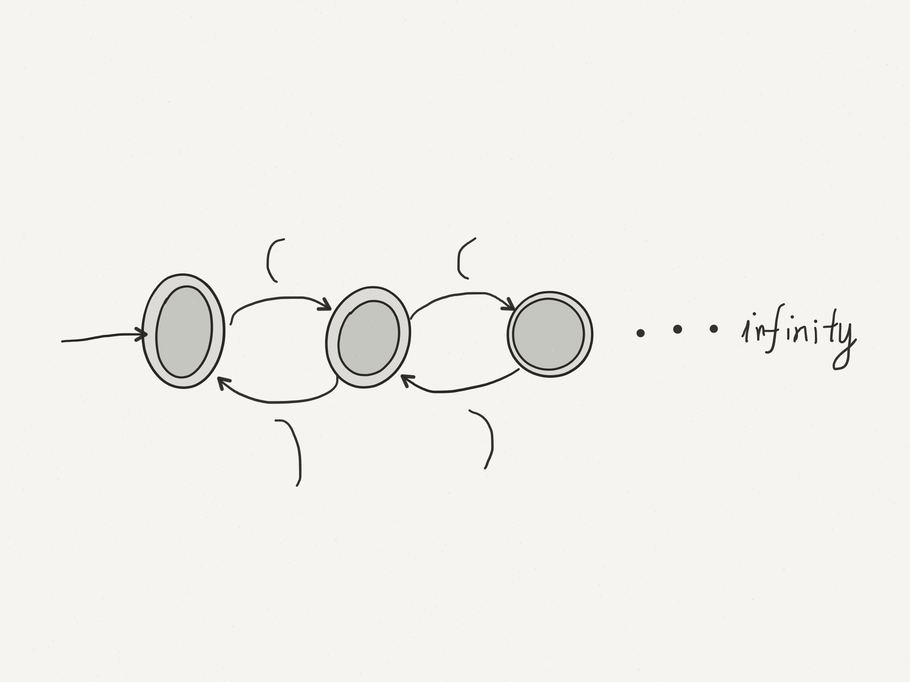

# Lecture 12

## Maximum Munch Algorithm

Run DFA (without $\epsilon$-moves) until no non-error move is possible.    
```
If in accepting state, output token founded.    
else	back up to most recent accepting state (use a variable to keep track of this)    
		input to that points is next token   
		resume scanning from there    
endif
```
output token: $\epsilon$ move back to go

## Simplified Maximum Munch Algorithm
As above, but if not in a accepting state when no transition is possible, error (no move back)

#### Example: 
1. Must start and end with a letter, can contain -
2. Operator --

```
ab--
   ^ - scan to this point
     - no further move is possible
	 - but ab-- not a valid token, so not in an accepting state.
	   Simplified Maximum Munch: ERROR
	   Maximum Much: back up to previous accepting state (ab), scan from there
	                 tokens: ab, --
```

In practice, Simplified Maximum Munch usually good enough. Language typically designed to facilitate scanning by Simplified Maximum Munch.

Example in C++: vector \<vector\<int\>\> v;

C++ longest match scanner scans this as one token, >> rather than as > >    
C++ solution: adapt the language to the scanner, must separate > by space to create two tokens.

What (if any) specific feature of C (or scheme) programs cannot be verified with DFA.

Consider $\Sigma=\{(,)\}$ $L=\{w\in\Sigma ^*|w$ is a string of balanced parentheses$\}$    
e.g $\epsilon\in L$, $()\in L$, $()()\in L$, $(())\in >$, $)(\not\in L$, $())\not\in L$



Each new state recognizes one more level of nesting - but no finite number of states recognizes all levels of nesting, and DFAs must have finitely many states.

## Context-Free Languages
Languages that can be described by a context-free grammar, set of "rewrite rules".

#### Intuition: balanced pares
* A word in the language is either empty $S\rightarrow\epsilon$
* or a word in the language surrounded by () $S\rightarrow(S)$
* or the concatenation of two words in the language $S\rightarrow SS$

Shorthand: S->E|(S)|SS

Show this system generates (())()
```
S=>SS=>(S)S=>((S))S=>(())S=>(())(S)=>(())()
```

Notation: "=>" = "derives"
"a=>b" means $b$ can be obtained from $a$ by one application of grammar rule.

### Formal Definition
A context-free grammar consists of

* An alphabet $\Sigma$ of terminal symbols.
* A finite non-empty set $N$ of non-terminal symbols, $N\cap\Sigma = \emptyset$ (we use $V$ (vocabulary) to denote $N\cup\Sigma$)
* A finite set $P$ of productions. Productions have the form $A\rightarrow B$ where $A\in N$, $B\in V ^*$
* An element $S$ in $N$ (start symbol)

Conventions:

* $a, b, c, ...$ elements of $\Sigma$ (characters)
* $x, y, z, ...$ elements of $\Sigma ^*$ (string)
* $A, B, C, ...$ elements of $N$ (non-terminals)
* $S$ start symbol
* $\alpha, \beta, \gamma, ...$ elements of $V ^*$ ($(N\cup\Sigma)^*$)

We write $\alpha AB\Rightarrow \alpha\gamma B$ if there is a production $A->\gamma$ in $P$ (RHS derivable from the LHS in one step). 

$\alpha\Rightarrow *\beta$ means $a\Rightarrow ...\Rightarrow\beta$ (0 or more steps)

### Definition
$L(G)=\{w\in\Sigma ^* | S\Rightarrow *w\}$ language specified by $G$, string of terminals derivable from $S$.

A language $L$ is context-free if $L=L(G)$ for some context-free grammar $G$.

#### Example: Palindromes over $\{a, b, c\}$
$S\rightarrow aSa|bSb|cSc|M$, $M\rightarrow \epsilon|a|b|c$   
Show: $S\Rightarrow*abcba$    

$S\Rightarrow aSa\Rightarrow abSba\Rightarrow abMba\Rightarrow abcba$

Expressions: $\Sigma = \{a, b, c, +, -, *, /\}$ $L=\{$arithmetic expressions, using symbol from $\Sigma\}$

$S\rightarrow S OP S|a|b|c|(S)$, $OP\rightarrow +|-|*|/$    

$\Sigma = \{a, b, c, +, -, *, /, (, )\}$ $L=\{$arithmetic expressions, using symbol from $\Sigma\}$

$S\rightarrow S OP S|a|b|c$, $OP\rightarrow +|-|*|/$    

Show: S=>*a+b

$S=>S op S=>a op S=>a + S=>a + b$

Leftmost derivation -- always expand leftmost symbol first

Rightmost derivation -- always expand rightmost symbol first.
