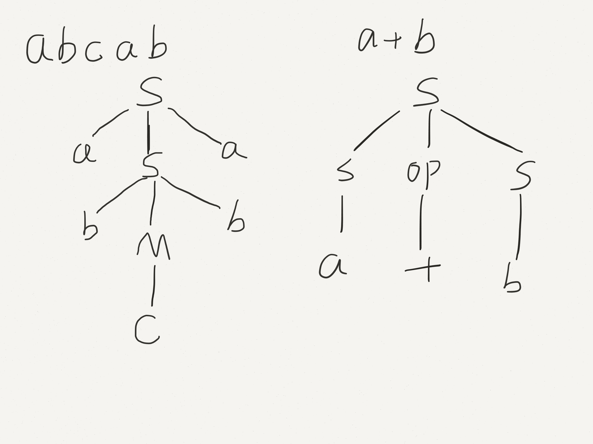
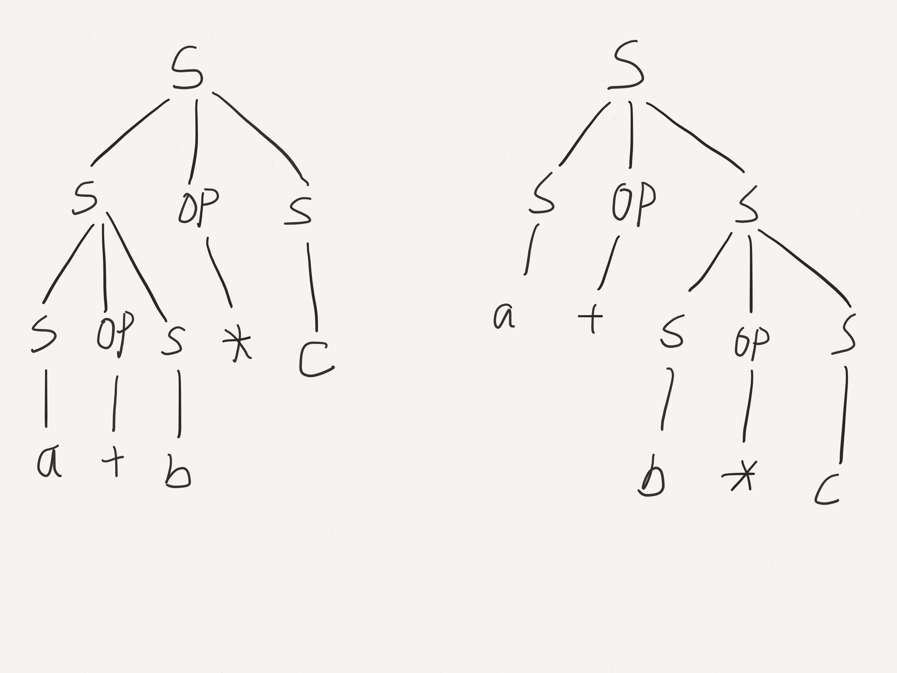

# Lecture 13

Derivations can be expressed naturally and succinctly as trees (called parse trees):



For every leftmost (or rightmost) derivation, there is a unique parse tree.

E.g. leftmost derivation for $a + b * c$

```
S => S op S => S op S op S => a op S op S => a + S op S => a + b op S => a + b * S => a + b * c
or
S => S op S => a op S => a + S => a + S op S => a + b op S => a + b * S => a + b * c
```

These produce different parse trees:



A grammar for which some word has more than one distinct leftmost derivation (equivalent, parse tree) is called **ambiguous**.

$S\rightarrow S\enspace op\enspace S|a|b|c$, $op\rightarrow +|-|*|/$ is an ambiguous grammar.

If we only care answering whether $w\in L(G)$, ambiguity does not matter. But as compiler writers, we want to know why $w \in L(G)$. i.e. the derivation matters.

The shape of the parse tree describes the meaning of the string, so a word with multiple parse tree can have multiple meanings.


So $a+b*c$ could mean $(a+b)*c$ or $a+(b*c)$. What do we do?

1. Use heuristics (precedence) to guide the derivation process.
2. Make the grammar unambiguous.

$E\rightarrow E\enspace op\enspace T|T$   
$T\rightarrow a|b|c$     
$op\rightarrow +|-|*|/$

```
a + b * c: E => E op T => E op T op T => T op T op T => a op T op T => ... => a + b * c
```


This grammar is strict left-to-right precedence.

What if we want to give $*,/$ precedence over $+, -$?

$E\rightarrow E\enspace PM\enspace T|T$    
$T\rightarrow T\enspace TD\enspace F|F$     
$F\rightarrow a|b|c|(E)$    
$PM\rightarrow +|-$     
$TD\rightarrow *|/$

```
a + b * c: E => E PM T => T PM T => F PM T => a PM T => a + T => a + T TD F => a + f TD F => a + b TD F => a + b * F => a + b * c
```


Q: If $L$ is contest-free, is there always an unambiguous grammar $G$ such that $L(G)=L$?    
A: No! There are inherently ambiguous languages that only have ambiguous grammars.

Q: Can we construct a tool that tell us if a grammar is ambiguous?     
A: No! Undecidable.

Equivalence of grammars $G_1+G_2$ (i.e. $L(G_1)=L(G_2)$) is also undecidable.

## Recognizers

What class of computer programs is needed to recognize a Context-Free Language?

* **Regular Language**: DFA, essentially a program with finite memory.
* **Context-Free Language**: NFA + stack, infinite memory, but use is limited to LIFO order.

But we need more than just a Y/N answer -- need the derivation (parse tree) or message. Problem of finding the derivation is called parsing.

Given: Grammar $G$, start symbol $S$, word $W$   
Find: $S\Rightarrow ... \Rightarrow w$ (or report that there is no derivation)

How can this be done? 2 choices:

1. **Forwards (top-down)**: start at $S$, expand until you reach $w$.
2. **Backwards (bottom-up)**$: start at $w$, figure out how to get back to $S$.

