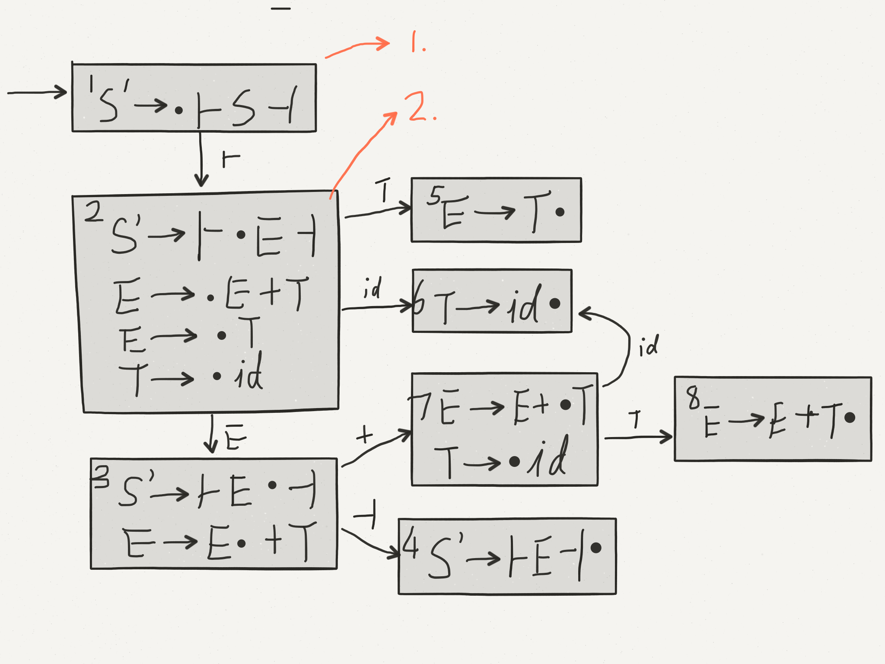
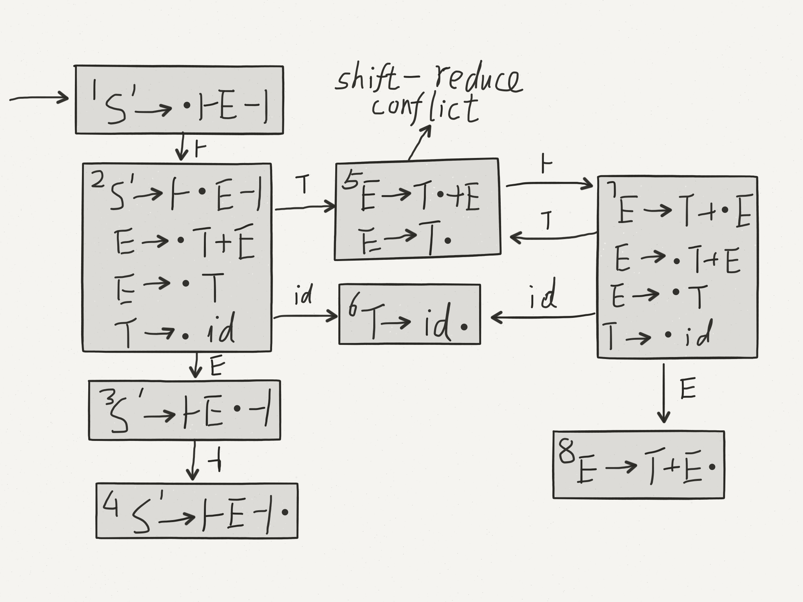

# Lecture 16

The set $\{wa|\exists x, S'\Rightarrow ^*wax\}$ ($w$: stack, $a$:next char) is a **regular language**

* can be described by a DFA
* use the DFA to make shift/reduced decisions.

## LR parsing

* left-to-right scan
* rightmost derivations

#### Example
$S'\rightarrow\vdash E\dashv$   
$E\rightarrow E+T$   
$E\rightarrow T$   
$T\rightarrow id$

### LR(0) machine (simplest)

#### Definition
An **item** is a production with a dot ($\cdot$) somewhere on the RHS. (indicates partially completed rule)



1. Label and arc with the symbol that follows the dot; advance the dot in the next state.
2. If the dot precedes a non-terminal $A$, add all productions with $A$ on the LHS to the state, dot in leftmost positions

#### Using the Machine

Start in start state with empty stack.

**Shifting**

* shift character from input to stack
* follow transition for that character to next state
* if no transition: error or reduce

**Reducing**

* "reduce states" have only one term and dot is rightmost (complete item)
* reduce by the rule in the state.

reduce: pop RHS off the stack, backtrack size(RHS) states in the DFA, push LHS, follow shift transition for the LHS.

Backtracking the DFA - must remember DFA states. Thus, push DFA states on the stack as well.

|Stack|             Read Input|             Unread Input|               Actions|
|---|---|---|---|
|$1$|               $\epsilon$|             $\vdash id+id+id\dashv$|    S2 (shift and goto 2)|
|$1\vdash 2$|       $\vdash$|               $id+id+id\dashv$|           S6 (shift and goto 6)|
|$1\vdash 2id6$|    $\vdash id$|            $+id+id\dashv$|             R T$\rightarrow$id pop 1 symbol 1 state. Now is state 2, Push T, goto 5|
|$1\vdash 2T5$|     $\vdash id$|            $+id+id\dashv$|             R E$\rightarrow$T pop 1 symbol 1 state.|
|$1\vdash 2E3$|     $\vdash id$|            $+id+id\dashv$|             S7 (shift and goto 7)|
|$1\vdash 2E3+7$|   $\vdash id+$|           $id+id\dashv$|              S6 (shift and goto 6)|
|$1\vdash 2E3+7id6$|$\vdash id+id$|         $+id\dashv$|                R T$\rightarrow$id, goto 8|
|$1\vdash 2E3+7T8$| $\vdash id+id$|         $+id\dashv$|                R E$\rightarrow$E+T, pop 3 symbol 3 states. Now is state 2, Push E, goto 3|
|$1\vdash 2E3$|     $\vdash id+id$|         $+id\dashv$|                S7 (shift and goto 7)|
|$1\vdash 2E3+7$|   $\vdash id+id+$|        $id\dashv$|                 S6 (shift and goto 6)|
|$1\vdash 2E3+7id6$|$\vdash id+id+id$|      $\dashv$|                   R T$\rightarrow$id, goto 8|
|$1\vdash 2E3+7T8$| $\vdash id+id+id$|      $\dashv$|                   R E$\rightarrow$E+T goto 3|
|$1\vdash 2E3$|     $\vdash id+id+id$|      $\dashv$|                   S4 (shift and goto 4)|
|$1\vdash 2E3\dashv 4$|$\vdash id+id+id\dashv$|$\epsilon$|              Accept|

What can go wrong?

What if a state looks like this:

$A\rightarrow\alpha\cdot c\beta$    
$B\rightarrow\gamma\cdot$

Shift $c$ or reduce $B\rightarrow\gamma$? This is a shift-reduce conflict.

$A\rightarrow\alpha\cdot$    
$B\rightarrow\beta\cdot$

Reduce $$A\rightarrow\alpha$ or $B\rightarrow\beta$? This is a reduce-reduce conflict.

Whenever a complete item $A\rightarrow\alpha\cdot$ is not alone in a state, there is a conflict, and the grammar is not LR(0).

E.g. Right-associative

$S'\rightarrow\vdash E\dashv$   
$E\rightarrow T+E$   
$E\rightarrow T$    
$T\rightarrow id$



E.g. Input starts with $\vdash id....$

```
 _____ shift   _____ shift   _____ reduce  _____
|      ------>||-    ------>||-id  ------>||-T
|_____        |_____        |_____        |_____
   1             2             3             4
```

Should we reduce $E\rightarrow T$?

Depends:

* If input is $\vdash id\dashv$ then yes.
* If input is $\vdash id+...$ then no.

Add lookahead to fix the conflict.

For each $A\rightarrow\alpha\cdot$, attach $Follow(A)$

$Follow(E)=\{\vdash\}$    
$Follow(T)=\{+,\vdash\}$   

$E\rightarrow T\cdot + E$   
$E\rightarrow T\cdot$    
becomes   
$E\rightarrow T\cdot + E$   
$E\rightarrow T\cdot\quad\dashv$

#### Interpretation:
$A$ reduce action $A\rightarrow\cdot\quad x$ ($x=Follow(A)$) only applies if the next character is in $x$.    
So $E\rightarrow T\cdot$ applies when next character is $\dashv$.    
$E\rightarrow T\cdot+E$ applies when next character is $+$.

Conflict resolved

Result is called an SLR(1) parser. (Simple LR with 1 character lookahead.

SLR(1) resolves many, but not all, conflicts.

LR(1) is more powerful than SLR(1), but produces many more states.

## Building a Parse Tree

#### Top-down
```
 _____
|-|S     S->AyB
|_____

 _____
|-|AyB   Keep S
|  \|/
|   S
|_____
```

Make the new nodes its children.

#### Bottom-up 
```
 _____
||-ab    Reduce A->ab
|_____

 _____
|-|A     Keep A
| / \
|a   b 
|_____
```    

Attach old nodes as children of the new node.
